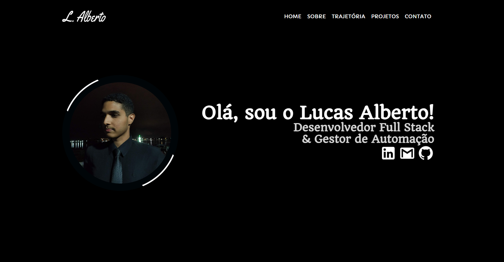

# Lucas Alberto - Portfólio 

Bem-vindo ao repositório do meu portfólio pessoal! Este projeto foi desenvolvido para centralizar minha trajetória profissional, competências técnicas e os principais projetos que desenvolvi ao longo da minha carreira como **Desenvolvedor Full Stack**.

---

## Sobre o Projeto

O objetivo deste portfólio é oferecer uma experiência de usuário fluida e moderna, destacando não apenas o código, mas também a atenção ao design e usabilidade. Cada detalhe foi pensado para transmitir profissionalismo e inovação.

### Principais Funcionalidades

- **Modal de Projetos Dinâmico**: Visualização detalhada de cada projeto com tecnologias, descrição e links diretos para deploy e repositório.
- **Design Responsivo**: Adaptabilidade total para dispositivos móveis, tablets e desktops.
- **Animações Interativas**: Uso de animações de scroll (AOS) para uma navegação mais envolvente.
- **Estética "Premium"**: Combinação de cores elegantes, tipografia moderna e ícones vetoriais (SVG).
- **SEO Otimizado**: Estrutura semântica para melhor visibilidade em motores de busca.

---

## Tecnologias Utilizadas

Este projeto foi construído utilizando as tecnologias mais modernas do ecossistema front-end:

- **[Angular 18](https://angular.dev/)**: Utilizando as melhores práticas como *Signals*, *Standalone Components* e o novo *Control Flow*.
- **[Tailwind CSS](https://tailwindcss.com/)**: Para estilização rápida, eficiente e totalmente responsiva.
- **[Sass (SCSS)](https://sass-lang.com/)**: Para customizações avançadas e organização de estilos globais.
- **[AOS (Animate On Scroll)](https://michalsnik.github.io/aos/)**: Para transições suaves durante a rolagem.
- **[Lucide SVG Icons](https://lucide.dev/)**: Ícones vetoriais nítidos e leves.
- **[Vercel](https://vercel.com/)**: Para hospedagem e deploy contínuo.

---

## Projetos em Destaque

Alguns dos projetos que você encontrará no portfólio:

- **Construtiva**: Sistema ERP de gerenciamento de obras com assistente de IA/RAG.
- **Popblitz**: Jogo multiplayer interativo focado em adivinhação de cultura pop.
- **DAI**: Assistente virtual inteligente com integração de base de conhecimento personalizada.
- **Gestão de Mentoria**: Sistema completo para acompanhamento de mentorados e atividades.

---

## 📬 Contato

Vamos nos conectar e construir algo incrível juntos!

- **Website:** [lucasalberto.online](https://lucasalberto.online)
- **LinkedIn:** [Lucas Alberto](https://www.linkedin.com/in/lucasalberto0)
- **GitHub:** [@LucasAlberto0](https://github.com/LucasAlberto0)
- **E-mail:** [lucasalberto4321@gmail.com](mailto:lucasalberto4321@gmail.com)

---

Desenvolvido por **Lucas Alberto**.
